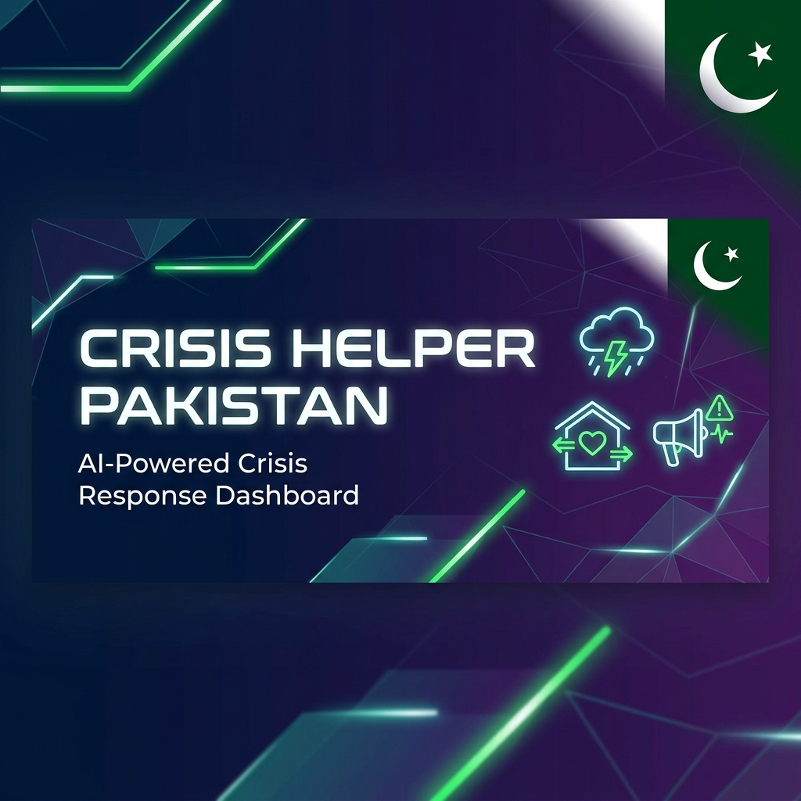
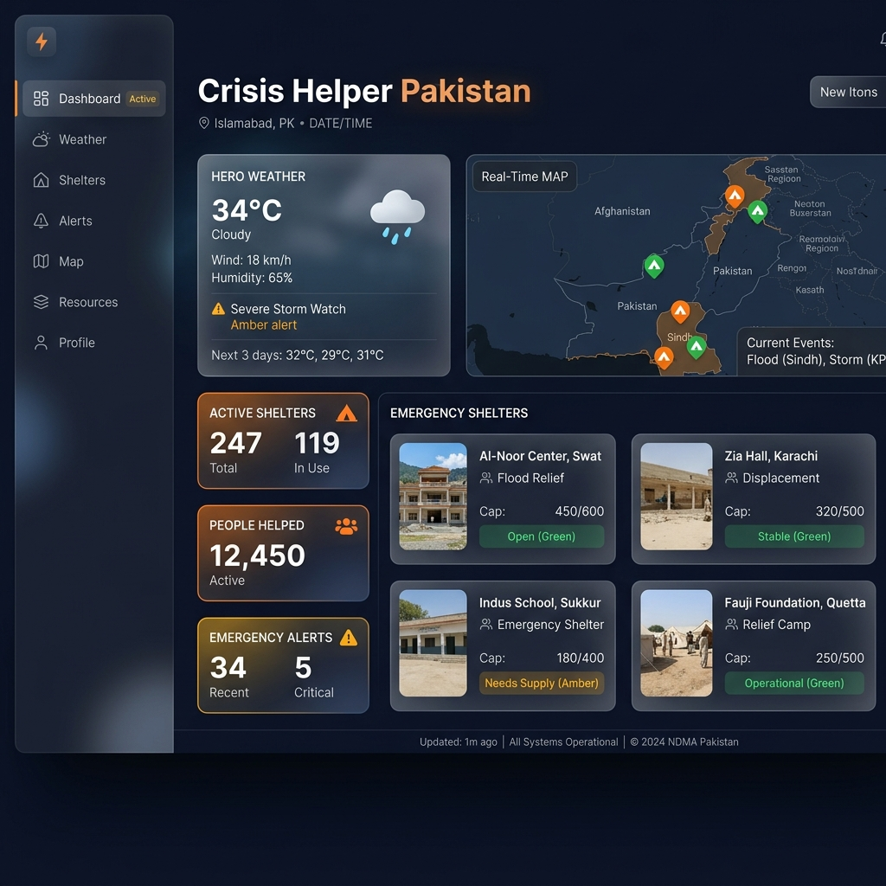

<div align="center">
  

  <h3>🚨 AI-Powered Crisis Response Dashboard for Pakistan</h3>
  <p>Real-time emergency shelters, live weather updates & actionable disaster management tools</p>

  <p>
    
    
    
    
    
  </p>
</div>

---

## 📸 Preview

<div align="center">
  
</div>

---

## ✨ Features

| Feature | Description |
|---------|-------------|
| 🌦️ **Live Weather** | Real-time weather data with premium hero layout |
| 🏠 **Shelter Discovery** | Find nearby emergency shelters with image-rich cards |
| 🤖 **AI-Powered Insights** | Gemini AI integration for crisis analysis & guidance |
| 📊 **Emergency Dashboard** | Actionable overview with real-time crisis stats |
| 🎨 **Premium UI** | Glassmorphism, smooth animations & dark mode |
| 📱 **Responsive** | Works seamlessly on desktop, tablet & mobile |

---

## 🛠️ Tech Stack

- **Frontend:** React 19, TypeScript, Tailwind CSS 4
- **Build Tool:** Vite 6
- **AI:** Google Gemini API
- **Animations:** Motion (Framer Motion)
- **Icons:** Lucide React
- **Server:** Express.js (API proxy)

---

## 🚀 Getting Started

### Prerequisites
- Node.js (v18+)
- Gemini API Key — [Get one here](https://aistudio.google.com/apikey)

### Installation

```bash
# Clone the repository
git clone https://github.com/MananAli05/crisis-helper-pakistan.git
cd crisis-helper-pakistan

# Install dependencies
npm install

# Set up environment variables
cp .env.example .env
# Add your GEMINI_API_KEY to .env

# Run the development server
npm run dev
```

The app will be available at `http://localhost:3000`

---

## 📁 Project Structure

```
crisis-helper-pakistan/
├── src/
│   ├── App.tsx              # Main application component
│   ├── main.tsx             # React entry point
│   ├── index.css            # Global styles
│   └── services/
│       └── geminiService.ts # Gemini AI integration
├── assets/                  # Images & media
├── index.html               # HTML entry point
├── server.js                # Express API server
├── vite.config.ts           # Vite configuration
├── tsconfig.json            # TypeScript config
└── package.json             # Dependencies & scripts
```

---

## 🤝 Contributing

Contributions are welcome! Feel free to open an issue or submit a pull request.

---

## 📄 License

This project is licensed under the MIT License.

---

<div align="center">
  <p>Made with ❤️ for Pakistan</p>
  <p>
    <a href="https://github.com/MananAli05">
      
    </a>
  </p>
</div>
